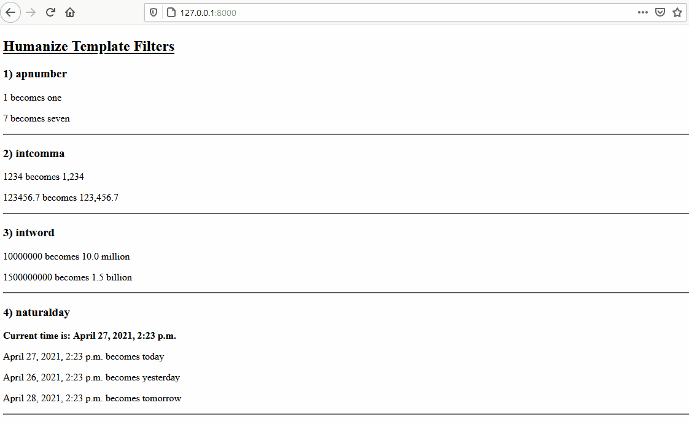

# Demonstration of Humanize Tags in Django
__This is the simple example for the project discussed in the blog post: [How to Use Humanize Tags in Django
](https://codefires.com/how-use-humanize-tags-django/)__

## To run this project follow these steps:
```javascript
git clone https://github.com/thecodefires/django-humanize-tags.git
```
```python
pip install -r requirements.txt
```
```python
python manage.py migrate
```
```python
python manage.py runserver
```
## Output

